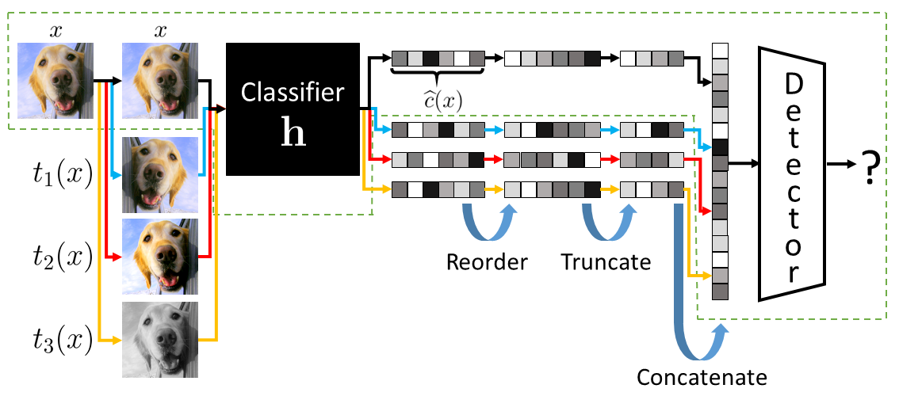

# Confidence From Invariance
This is the official TensorFlow implementation of the error and novelty detection method described in the arXiv paper [Confidence from Invariance to Image Transformations](https://arxiv.org/abs/1804.00657) by Yuval Bahat and Gregory Shakhnarovich.

The core idea behind this method is to base an image classification confidence measure on the variations in the classifier's outputs corresponding to different natural transformations of the image at hand. This is done by training a simple multi-layer-perceptron on a given classifier's outputs corresponding to the original image and its transformed versions. Note that our method does not require any access to the classifier model parameter, and instead operates on any given image classifier by treating it as a "black box". Please see the paper for more details.



If you find our work useful in your research or publication, please cite it:

```
@article{bahat2018confidence,
  title={Confidence from Invariance to Image Transformations},
  author={Bahat, Yuval and Shakhnarovich, Gregory},
  journal={arXiv preprint arXiv:1804.00657},
  year={2018}
}
```
----------
# Usage:

The core transformations TensorFlow operators are implemented in file Transformations.py. These operators can be incorporated for both error detection and novelty detection, as described in the paper.

We provide here an example usage of error detection on a pre-trained CIFAR-10 classifier. The classifier model code was modified from the [CIFAR-10 classifier by TensorFlow](https://github.com/tensorflow/models/tree/master/tutorials/image/cifar10).

## Detector training:
To train a detector, set ```TRANSFORMATIONS_LIST``` (in train_detector.py) to include the desired transformations (from the list in Transformations.py). When setting it to an empty list, the input to the detector will consist the logits of the original input image alone. To start training, run

```python train.detector.py -layers_widths <LAYERS_WIDTHS> -descriptor <MODEL_DESCRIPTOR> -train```,

where the number of hidden layers and the number of channels in each layer in the detector is set using ```LAYERS_WIDTHS``` and ```MODEL_DESCRIPTOR``` is a name used for saving the model and comparing ROC curves. For example,

```python train.detector.py -layers_widths 70 70 -descriptor 70_70 -train```

will train a detector with 2 hidden layers, each with 70 channels, and will use the name ```70_70```.

To resume training of a pre-trained detector use ```-resume_train``` instead of ```-train```. To evaluate a pre-trained detector, simply omit these flags.

## Detector training and evaluation sets:
The detector is trained on a portion of the original validation set, by assigning this portion to be used as detector training images, while the rest of the images are used for its evaluation. In order to compare different detector configurations and compare to other methods, the same assignment is reused by saving it to ```ValidationSetSplit_<TRAIN_PORTION>.npz```. The repository includes the assignment for the default ```TRAIN_PORTION```=0.5 assignment.

## Saved models and figures:
Detector models are regularely saved into a sub-folder to allow later evaluation or further training. Each time a detector is evaluated (either during training or evaluation runs), a Receiver Operating Characteristic (ROC) curve is saved to a figure in a designated sub-folder, and compared to all previously trained detectors.
